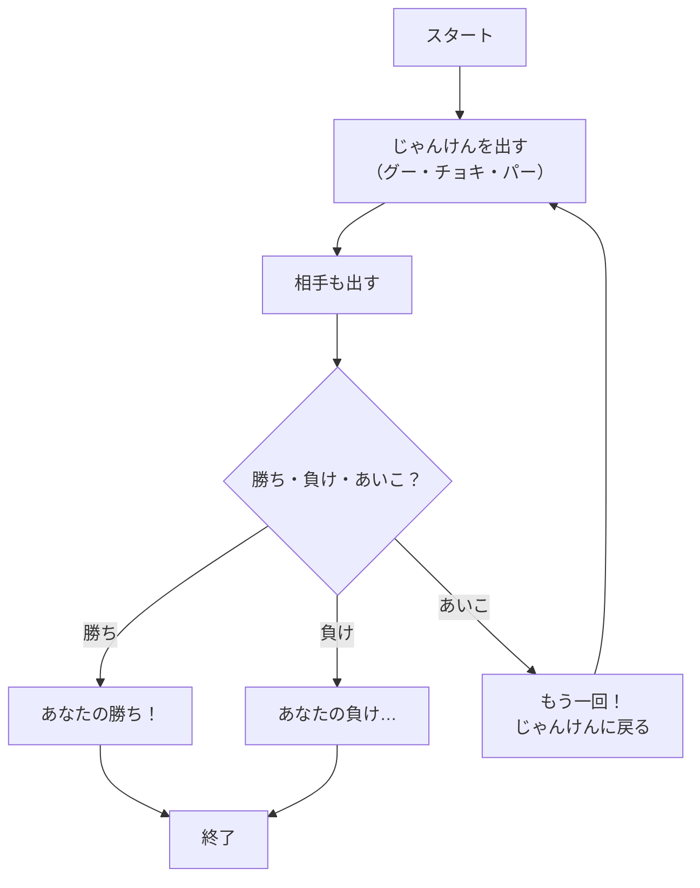

```mermaid
flowchart TD
    A[スタート] --> B[じゃんけんを出す<br>（グー・チョキ・パー）]
    B --> C[相手も出す]
    C --> D{勝ち・負け・あいこ？}
    D -- 勝ち --> E[あなたの勝ち！]
    D -- 負け --> F[あなたの負け…]
    D -- あいこ --> G[もう一回！<br>じゃんけんに戻る]
    E --> Z[終了]
    F --> Z
    G --> B
```
