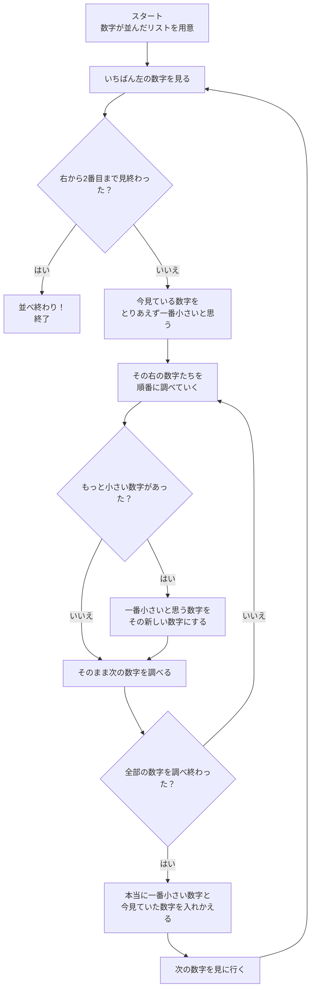

```mermaid
flowchart TD
    A[スタート<br>数字が並んだリストを用意] --> B[いちばん左の数字を見る]
    B --> C{右から2番目まで見終わった？}
    C -- はい --> Z[並べ終わり！<br>終了]
    C -- いいえ --> D[今見ている数字を<br>とりあえず一番小さいと思う]
    D --> E[その右の数字たちを<br>順番に調べていく]
    E --> F{もっと小さい数字があった？}
    F -- はい --> G[一番小さいと思う数字を<br>その新しい数字にする]
    F -- いいえ --> H[そのまま次の数字を調べる]
    G --> H
    H --> I{全部の数字を調べ終わった？}
    I -- いいえ --> E
    I -- はい --> J[本当に一番小さい数字と<br>今見ていた数字を入れかえる]
    J --> K[次の数字を見に行く]
    K --> B
```
