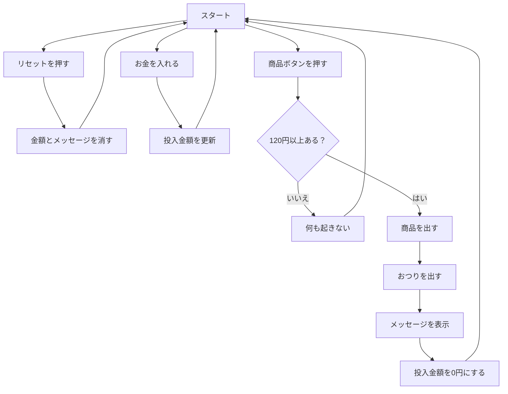

```mermaid
flowchart TD
  Start[スタート]

  %% 並列で可能なアクション
  Start --> InsertMoney[お金を入れる]
  Start --> PressReset[リセットを押す]
  Start --> PressProduct[商品ボタンを押す]

  %% リセットの処理
  PressReset --> ResetAll[金額とメッセージを消す]
  ResetAll --> Start

  %% お金を入れる処理
  InsertMoney --> UpdateAmount[投入金額を更新]
  UpdateAmount --> Start

  %% 商品ボタン押下処理
  PressProduct --> EnoughMoney{120円以上ある？}

  EnoughMoney -- いいえ --> NoAction[何も起きない]
  NoAction --> Start

  EnoughMoney -- はい --> Purchase[商品を出す]
  Purchase --> ReturnChange[おつりを出す]
  ReturnChange --> ShowMessage[メッセージを表示]
  ShowMessage --> ResetAmount[投入金額を0円にする]
  ResetAmount --> Start
```
