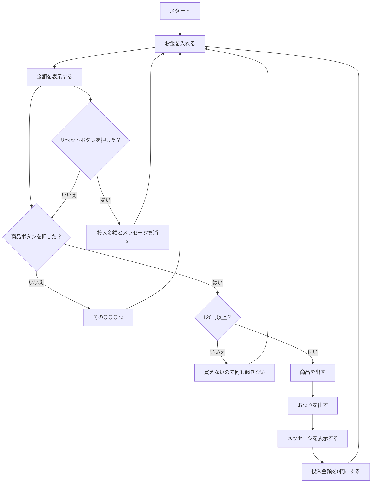

```mermaid
flowchart TD
  A[スタート] --> B[お金を入れる]
  B --> C[金額を表示する]
  C --> D{商品ボタンを押した？}

  D -- いいえ --> E[そのまままつ]
  E --> B

  D -- はい --> F{120円以上？}

  F -- いいえ --> G[買えないので何も起きない]
  G --> B

  F -- はい --> H[商品を出す]
  H --> I[おつりを出す]
  I --> J[メッセージを表示する]
  J --> K[投入金額を0円にする]
  K --> B

  C --> L{リセットボタンを押した？}
  L -- はい --> M[投入金額とメッセージを消す]
  M --> B
  L -- いいえ --> D
```
