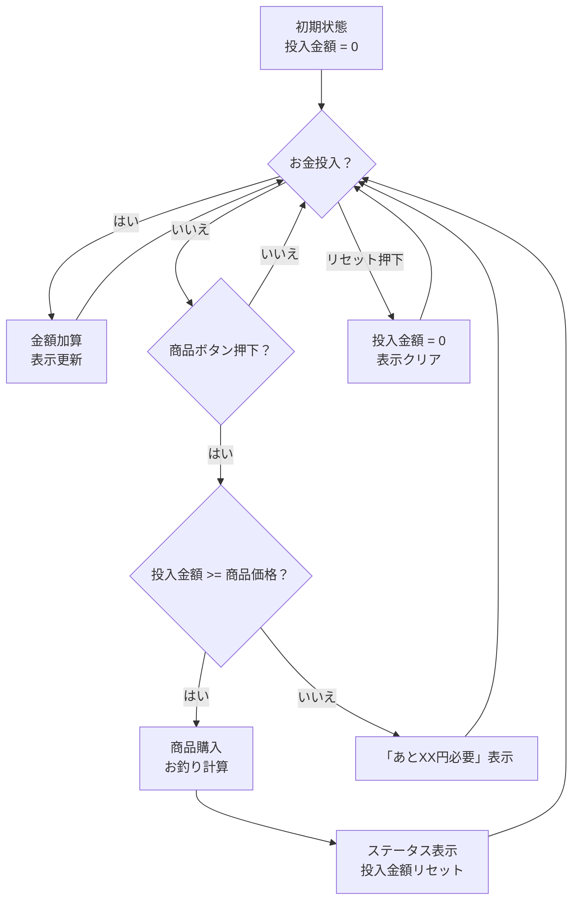

```mermaid
flowchart TD
    A[初期状態<br>投入金額 = 0] --> B{お金投入？}
    B -->|はい| C[金額加算<br>表示更新]
    C --> B

    B -->|いいえ| D{商品ボタン押下？}
    D -->|いいえ| B
    D -->|はい| E{投入金額 >= 商品価格？}

    E -->|はい| F[商品購入<br>お釣り計算]
    F --> G[ステータス表示<br>投入金額リセット]
    G --> B

    E -->|いいえ| H[「あとXX円必要」表示]
    H --> B

    B -->|リセット押下| I[投入金額 = 0<br>表示クリア]
    I --> B
```
