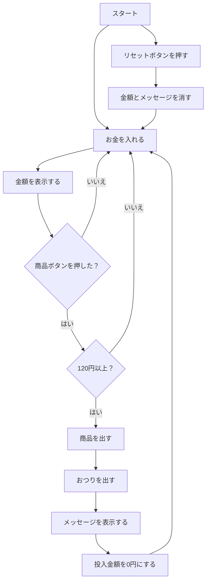

```mermaid
flowchart TD
  A[スタート] --> B[お金を入れる]
  A --> R[リセットボタンを押す]
  R --> S[金額とメッセージを消す]
  S --> B

  B --> C[金額を表示する]
  C --> D{商品ボタンを押した？}

  D -- いいえ --> B

  D -- はい --> E{120円以上？}

  E -- いいえ --> B

  E -- はい --> F[商品を出す]
  F --> G[おつりを出す]
  G --> H[メッセージを表示する]
  H --> I[投入金額を0円にする]
  I --> B
```
