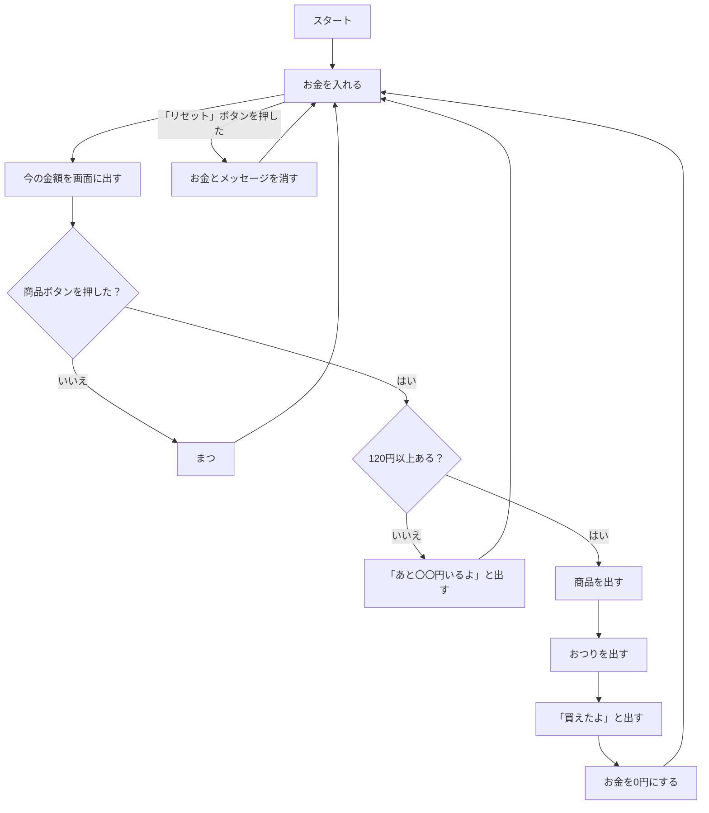

```mermaid
flowchart TD
  A[スタート] --> B[お金を入れる]
  B --> C[今の金額を画面に出す]
  C --> D{商品ボタンを押した？}

  D -- いいえ --> E[まつ]
  E --> B

  D -- はい --> F{120円以上ある？}

  F -- いいえ --> G[「あと〇〇円いるよ」と出す]
  G --> B

  F -- はい --> H[商品を出す]
  H --> I[おつりを出す]
  I --> J[「買えたよ」と出す]
  J --> K[お金を0円にする]
  K --> B

  B -- 「リセット」ボタンを押した --> L[お金とメッセージを消す]
  L --> B
```
